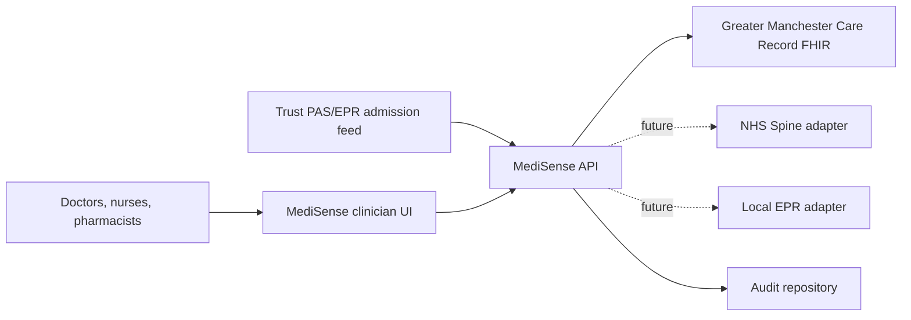
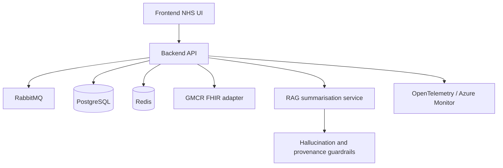
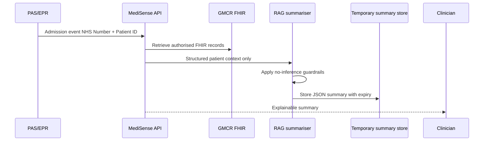

# MediSense™ Greater Manchester MVP

## 1. Solution architecture

MediSense™ is a pilot admission-summary service for one Greater Manchester NHS Trust. An admission event containing NHS Number, local Patient ID and event metadata triggers authorised retrieval from the Greater Manchester Care Record (GMCR) FHIR API. Retrieved records are normalised, summarised with deterministic guardrails, tagged with provenance, stored temporarily against the active admission and removed immediately at discharge.

### Runtime components

- **Frontend:** Next.js/TypeScript/Tailwind target using NHS Design System patterns. This repository includes a static MVP dashboard that demonstrates the clinical workflow.
- **Backend:** NestJS/TypeScript target. This repository includes an Express MVP API with the same endpoint contract for rapid pilot validation.
- **Data:** PostgreSQL for durable clinical metadata and audit logs; Redis for admission-trigger cache and short-lived workflow locks.
- **Messaging:** RabbitMQ for admission and discharge events.
- **Integration:** GMCR FHIR adapter now; NHS Spine and local EPR adapters behind the same adapter interface.
- **AI/RAG:** retrieval, FHIR normalisation, structured patient context, deterministic JSON summary, hallucination guardrails, provenance tagging and temporary storage.
- **Hosting:** Azure UK South Kubernetes, private networking, Azure Monitor and OpenTelemetry.

## 2. C4 diagrams

### C1 context



### C2 container



### C3 summary generation



## 3. Database schema

```sql
CREATE TABLE patients (
  id uuid PRIMARY KEY,
  nhs_number text UNIQUE NOT NULL,
  dob date NOT NULL,
  created_at timestamptz NOT NULL DEFAULT now()
);

CREATE TABLE admissions (
  id uuid PRIMARY KEY,
  patient_id uuid NOT NULL REFERENCES patients(id),
  admission_time timestamptz NOT NULL,
  discharge_time timestamptz,
  status text NOT NULL CHECK (status IN ('active', 'discharged'))
);

CREATE TABLE source_records (
  id uuid PRIMARY KEY,
  patient_id uuid NOT NULL REFERENCES patients(id),
  source_system text NOT NULL,
  source_identifier text NOT NULL,
  record_date date NOT NULL,
  payload jsonb NOT NULL
);

CREATE TABLE ai_summaries (
  id uuid PRIMARY KEY,
  admission_id uuid NOT NULL REFERENCES admissions(id),
  summary_json jsonb NOT NULL,
  created_at timestamptz NOT NULL DEFAULT now(),
  expires_at timestamptz NOT NULL
);

CREATE TABLE audit_logs (
  id uuid PRIMARY KEY,
  user_id text NOT NULL,
  action text NOT NULL,
  resource text NOT NULL,
  timestamp timestamptz NOT NULL DEFAULT now()
);
```

## 4. API specification

| Method | Path | Purpose |
| --- | --- | --- |
| `POST` | `/admissions` | Create admission from NHS Number, Patient ID and admission event; automatically generates summary. |
| `POST` | `/generate-summary` | Regenerate an active admission summary. |
| `GET` | `/summary/{admissionId}` | Retrieve the active temporary summary. |
| `GET` | `/provenance/{summaryId}` | Retrieve source records for explainability drill-through. |
| `POST` | `/discharge` | Discharge admission, remove active summary and retain audit only. |
| `GET` | `/audit` | Retrieve audit events for IG and safety review. |

## 5. FHIR mapping design

| Summary section | FHIR resource candidates | Mapping notes |
| --- | --- | --- |
| Patient snapshot | `Patient`, `Encounter` | NHS Number from `Patient.identifier`, DOB from `Patient.birthDate`, admission from `Encounter.period.start`. |
| Diagnoses | `Condition` | Active vs historical from `clinicalStatus`, `verificationStatus` and recorded date. |
| Medication summary | `MedicationStatement`, `MedicationRequest` | Name, dose, frequency, indication and monitoring notes copied from source fields only. |
| Risks | `Flag`, `RiskAssessment`, `Observation`, `Condition` | Map explicit coded risks only; never infer risk from diagnoses. |
| Communication needs | `Communication`, `Observation`, `CarePlan` | Preferred method, sensory and neurodiversity needs from explicit records. |
| What helps/does not help | `CarePlan`, `Goal`, `Observation` | Include only recorded care preferences and support strategies. |

## 6. UI wireframes

- Header with NHS branding, pilot status and action buttons.
- Patient snapshot card with NHS Number, DOB, age and source provenance.
- Two-column clinical summary covering diagnoses, medications, risks, communication needs, what helps and what does not help.
- Provenance panel showing original source system, source record ID and source date for drill-through.
- Discharge kill-switch button for pilot demonstration.

## 7. Infrastructure architecture

- Azure UK South AKS private cluster.
- Azure Database for PostgreSQL with private endpoint and customer-managed keys.
- Azure Cache for Redis for short-lived workflow state.
- RabbitMQ on managed Kubernetes or Azure-supported marketplace image.
- Azure Key Vault for secrets and certificates.
- Azure Monitor, Log Analytics and Application Insights via OpenTelemetry collector.
- Terraform modules for network, AKS, data, observability and workload identity.

## 8. Security architecture

- NHS Identity-compatible OAuth2/OIDC with MFA enforced at the identity provider.
- RBAC roles: nurse, doctor, pharmacist, clinical safety officer, IG auditor and admin.
- TLS 1.2+ everywhere and encrypted PostgreSQL/Redis storage.
- Private ingress, zero-trust network segmentation and least-privilege workload identities.
- Full audit logging for admissions, summary generation, summary views, provenance views and discharge kill switch.
- OWASP controls: input validation, secure headers, dependency scanning, CSRF strategy for browser mutations and rate limiting.

## 9. DCB0129 hazard log

| ID | Hazard | Cause | Harm | Initial risk | Controls | Residual risk |
| --- | --- | --- | --- | --- | --- | --- |
| H-001 | Incorrect medication information | Outdated source medication record | Medication error | High | Display source date, provenance, confidence and disclaimer; require medication reconciliation workflow | Medium |
| H-002 | Missing risk information | Unavailable connected record | Patient/staff harm | High | Explicit unavailable statement, no inference, audit source retrieval failures | Medium |
| H-003 | Outdated source records | GMCR feed latency | Misleading summary | Medium | Show source date on every statement and flag records older than policy threshold | Low |
| H-004 | Incorrect patient matching | NHS Number/local ID mismatch | Wrong-patient care | High | Require NHS Number and Patient ID, adapter matching checks, audit mismatches | Medium |
| H-005 | AI hallucination | Model invents unsupported facts | Unsafe decisions | High | Structured JSON, deterministic settings, extractive-only guardrails and provenance validation | Medium |

## 10. MVP implementation backlog

1. Admission and discharge event ingestion.
2. GMCR FHIR adapter with consent and RBAC checks.
3. Structured FHIR normalisation and provenance model.
4. Deterministic summary generation and guardrail validation.
5. Clinician dashboard with NHS Design System components.
6. Audit, observability and safety dashboards.
7. Terraform and deployment pipeline.
8. Clinical safety documentation pack and pilot acceptance testing.

## 11. Sprint plan

- **Sprint 1:** admission trigger, schema, API skeleton, static UI, safety rules.
- **Sprint 2:** GMCR FHIR adapter, provenance drill-through, audit logging.
- **Sprint 3:** RAG service integration, hallucination validation, latency tuning.
- **Sprint 4:** NHS Identity integration, RBAC, penetration-test remediation.
- **Sprint 5:** UAT, DCB0129 evidence, pilot runbook and go/no-go review.

## 12. Deployment guide

1. Provision Azure UK South landing zone, private networking and Key Vault.
2. Deploy PostgreSQL, Redis, RabbitMQ and AKS with Terraform.
3. Configure NHS Identity OIDC client and RBAC claims mapping.
4. Deploy backend, frontend and OpenTelemetry collector containers.
5. Configure GMCR FHIR credentials and allow-list private endpoints.
6. Run database migrations and smoke tests.
7. Enable pilot users, monitor audit logs and clinical safety dashboard.

## 13. Test strategy

- Unit tests for summary guardrails, FHIR mappings and kill switch.
- Contract tests for API endpoints and GMCR adapter responses.
- Clinical safety scenario tests for medication, risk, communication and missing data.
- Security tests for RBAC, MFA claims, OWASP controls and audit integrity.
- Performance tests proving p95 summary generation below 10 seconds.
- User acceptance tests with doctors, nurses and pharmacists.

## 14. Pilot rollout plan

- Select one ward/service inside a single Greater Manchester NHS Trust.
- Train clinical champions and identify clinical safety officer sign-off route.
- Run shadow mode for two weeks with no clinical reliance.
- Move to supervised pilot with daily safety huddles and audit review.
- Measure record-search time, satisfaction, medication reconciliation time and incident feedback.
- Decide scale-up only after safety case acceptance and IG review.
